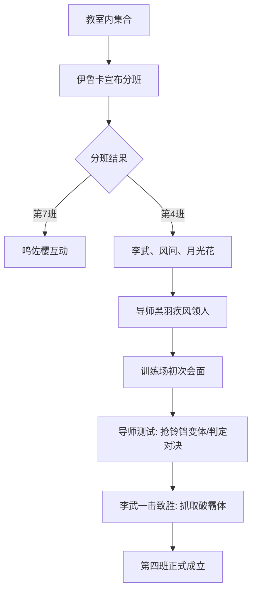

# 技术/剧情方案设计 - 第四章剧情重构

## 剧情架构

### 1. 经典重现：教室内的躁动
- **开场**：教室内，毕业生集结。李武坐在后排，通过系统观察全场能级。
- **互动**：鸣人蹲在桌子上与佐助对视（名场面预热或点到为止），伊鲁卡推门而入。
- **转折**：伊鲁卡宣布第7、8、10班成员。李武作为“多出来的变数”，与另外两名学生被编入新组建的“第四班”。

### 2. 第四班的“变数”设定
- **逻辑合规**：由于这一届毕业生人数较多（或因为李武和李洛克的加入），木叶决定增设带队老师。
- **队友逻辑**：风间小次郎（速度型）与月光花（幻术辅助型）在原著中属于默默无闻的小透明，但在李武眼中具有特定的技能能级。

### 3. 系统介入：能级解析
- **能级对比**：
  - 第七班：鸣人（白，封印态）、佐助（蓝，极不稳定）、小樱（白）。
  - 第四班：风间（蓝，极简速度）、月光花（白，精神偏高）。
- **判定预演**：李武对“上忍导师”的期待与判定解析。

### 4. 导师测试：演习场对决
- **流程调整**：各班老师依次领人。黑羽疾风在天台或训练场召集。
- **战斗重写**：保留原稿中“一招制胜”和“判定打断”的精髓，但加强环境描写。

## 技术栈（叙事技巧）

- **对比法**：用原著角色的“常规表现”衬托主角的“规格压制”。
- **第一人称内心独白（DNF风格）**：李武将忍者的配合视为“组队刷本”，将导师的防御视为“霸体机制”。
- **节奏控制**：前慢后快，文戏重流程，武戏重判定。

## Mermaid 流程表（简易剧情流）

